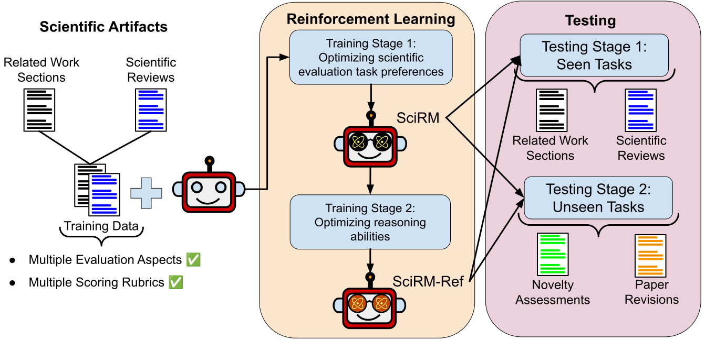

# Reward Modeling for Scientific Writing Evaluation

[](https://arxiv.org/abs/2601.11374)
[](https://opensource.org/licenses/Apache-2.0)
[](https://www.python.org/)

<p align="center">
  
<p align="center">

This repository contains training-evaluation code and other resources to replicate scientific writing reward model experiments introduced in the paper "[Reward Modeling for Scientific Writing Evaluation](https://arxiv.org/abs/2601.11374)".

> **Abstract:** Scientific writing is an expert-domain task that demands deep domain knowledge, task-specific requirements and reasoning capabilities that leverage the domain knowledge to satisfy the task specifications. While scientific text generation has been widely studied, its evaluation remains a challenging and open problem. It is critical to develop models that can be reliably deployed for evaluating diverse open-ended scientific writing tasks while adhering to their distinct requirements. However, existing LLM-based judges and reward models are primarily optimized for general-purpose benchmarks with fixed scoring rubrics and evaluation criteria. Consequently, they often fail to reason over sparse knowledge of scientific domains when interpreting task-dependent and multi-faceted criteria. Moreover, fine-tuning for each individual task is costly and impractical for low-resource settings. To bridge these gaps, we propose cost-efficient, open-source reward models tailored for scientific writing evaluation. We introduce a two-stage training framework that initially optimizes scientific evaluation preferences and then refines reasoning capabilities. Our multi-aspect evaluation design and joint training across diverse tasks enable fine-grained assessment and robustness to dynamic criteria and scoring rubrics. Experimental analysis shows that our training regime strongly improves LLM-based scientific writing evaluation. Our models generalize effectively across tasks and to previously unseen scientific writing evaluation settings, allowing a single trained evaluator to be reused without task-specific retraining.

✉️ Contact person: [Furkan Şahinuç](mailto:furkan.sahinuc@tu-darmstadt.de) 

[UKP Lab](https://www.ukp.tu-darmstadt.de/) | [TU Darmstadt](https://www.tu-darmstadt.de/)

Don't hesitate to send us an e-mail or report an issue, if something is broken (and it shouldn't be) or if you have further questions.

## Project Summary

We propose cost-efficient reward models that enable robust, fine-grained, and reasoning-aware evaluation of scientific writing across diverse tasks and dynamic evaluation criteria. Our model training consist of two-stage reinforcement learning to optimize the models for (1) scientific writing evaluation preferences and (2) reasoning abilities to better comprehend the given evaluation criteria.

## Project Structure

```text
│   .gitignore                      # A list of files to ignore when pushing to GH
│   LICENSE                         # The license for the project
│   NOTICE.txt                      # Legal notice for the repository
│   README.md                       # The main readme for the project
│   requirements.txt                # An empty file to hold the requirements for the project
│
│   train-unsloth.py                # Script for first training stage
│   prepare_tts_data.py             # Script for data preparation for second stage
│   train-unsloth-tts.py            # Script for second training stage
│   inference.py                    # Script for inference
│
└───example-data                    # Sample dataset
│
└───static                          # Image files 
```

## Installation

```
conda create -n reward_models python=3.11
conda activate reward_models
pip install -r requirements.txt
```

## Datasets

We use three datasets for experiments. ```final_reward_data.json``` file is the main dataset for training reward models. The dataset consists of related work section and review evaluation instances. ```prompted_novelty_data.json``` and ```prompted_revision_data.json``` are for testing scientific writing tasks that are not included in training data. The unseen tasks are novelty summary evaluation, and paper revision evaluation. The summary of the datasets are as follows:

  * ```final_reward_data.json```: Main dataset for training reward model.
  * ```prompted_novelty_data.json```: Testing dataset for unseen task experiments.
  * ```prompted_revision_data.json```: Testing dataset for unseen task experiments.

You can access the dataset by following this [link](https://tudatalib.ulb.tu-darmstadt.de/handle/tudatalib/4980).

## Training first stage:

In this step, we train our reward model via unsloth framework.

```
accelerate launch train-unsloth.py --exp_name "your_exp_name" --model_name "path to model or hf name" --dataset_file "training dataset file"
```

Parameter explanation:

* ```exp_name```
  * Identifier string that you determine for the experiment.

* ```model_name```
  * Local model path or huggingface model name. We use Qwen2.5-7B 

* ```dataset_file```
  * Dataset file for the training. 

* ```vllm_gpu_memory_utilization```
  * Allocated memory ratio for vllm sampling inference. Default value is `0.6`.

* ```max_model_len```
  * Maximum context length for training. Default value is `4096`.

* ```lora_rank```
  * Rank for LoRA training. Default value is `64`.

* ```max_tokens```
  * Maximum number of generated tokens for sampling inference. Default value is `512`.

* ```temp```
  * Temperature value for sampling inference. Default value is `1`.

* ```top_p```
  * top-p parameter for sampling inference. Default value is `0.95`.

* ```rollout```
  * Number of samples during inference. Default value is `4`.

* ```batch_size```
  * Default values is `4`.

* ```output_path```
  * Path to save trained model. Default path is `train-runs`.


## Training second stage:

For second step, you need initial reasoning for training data in second stage. You can use `inference.py` script for this. By default, `inference.py` run only for test split. Only for this step, it needs to be changed to training set in the `main` function. 

`eval_dataset = load_data(args.dataset_file)['train']`


```
python inference.py --exp_name "your_exp_name" --model_name "path to model or hf name" --dataset_file "training dataset file" --rollout 1 --output_path "path_to_save"
```

This will produce parquet files for each task along with results file. Now, you can prepare the data of second stage using output of the inference.

```
python prepare_tts_data.py --model_name "trained model path" --rev_util_outputs "parquet file generated for review task" --rw_gen_outputs "parquet file generated for related work task" --output_path "path_to_save"
```

Finally, you can implement second training stage by:

```
accelerate launch train-unsloth-tts.py --exp_name "your_exp_name_different_from_initial_training" --model_name "initially trained model path" --dataset_file "second stage training file"
```

## Testing

For testing, you can use `inference.py` with corresponding testing datasets:

  * ```final_reward_data.json```
  * ```prompted_novelty_data.json```
  * ```prompted_revision_data.json```


## Citation

Please use the following citation:

```
@misc{sahinuc2026reward,
    title       = {Reward Modeling for Scientific Writing Evaluation}, 
    author      = {Furkan \c{S}ahinu\c{c} and Subhabrata Dutta and Iryna Gurevych},
    year        = {2026},
    eprint      = {2601.11374},
    archivePrefix={arXiv},
    primaryClass={cs.CL},
    url         = {https://arxiv.org/abs/2601.11374}, 
}
```

## Disclaimer

> This repository contains experimental software and is published for the sole purpose of giving additional background details on the respective publication. 
